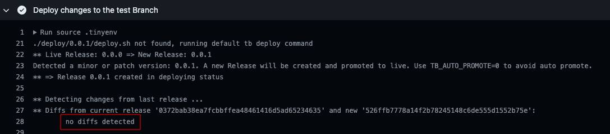

# How to migrate Tinybird Data Projects v2 to v3 with UI integration

1. Ask Tinybird to activate v3 in your data project. You will know it is activated when you see the UI like this:

    

2. Click `Connect to Git` to [connect your GitHub repository](https://www.tinybird.co/docs/version-control/working-with-version-control.html#connect-your-workspace-to-git-from-the-ui-title) using the Branch + Pull Request approach. As a result of this step, you will have a new branch (and an open Pull Request) in your repository. You will find changes related to format of the existing resources, new files and scripts. In the case you're using VERSION by file feature you will se new auto-generated resource files and some references changed in your code. Take your time to review it.
From this moment, you will see this in the UI:

    

3. For the next steps, you need to clone your GitHub repo to run some manual actions. 
   Go to the branch created by the PR (`git checkout tinybird_initial_sync`). Execute the [./scritps/v2_to_v3_UI.sh](./scripts/v2_to_v3_UI.sh) in your data project folder on the branch generated by the UI integration. It will perform the following actions:

   1. Point your GitHub Workflows to the correct template versions and remove the deprecated input `tb_deploy`.
   2. Backup the V2 custom deployments to a backup folder `deploy_v2`.
   3. Create or update the `./scripts/append_fixtures.sh` and `./scripts/exec_tests.sh` to the last compatible version.
   4. Update or create a new `requirements.txt` to use the latest `tinybird-cli` version (>=3.2.0).
   5. In the case you're using the deprecated future VERSION by file, new files with suffix __V(n) have been generated as a result of the step 2. The legacy ones will be removed.
   6. Set `.tinyenv` version to `0.0.0` <- With this step we ensure we don't deploy anything yet. MAKE SURE of this, deploying without finishing the next steps may lead to data loss.

4. Commit and push all the changes in the branch `tinybird_initial_sync`. The Pull Request CI checks will fail because we're not bumping the version. That's correct, merge anyway. 
   
5. Once the CD workflow finishes (it has to fail for the same reason of the previous step). Go to the repository's main branch, get the latest commit (`git log -n 1`) and execute `tb init --override-commit $LAST_COMMIT`.

6. Create a new branch, change the `.tinyenv` version to `0.0.1`. Create a PR and once all the checks passed. Check there are no changes and merge it.

    

7. Once the CD Workflow finishes, you should see this in the UI:

    

🎉 Congratulations! You're done, now you can enjoy the full Version Control experience using the UI or/and Git + Data Files. 
If you had any problem during the migration don't hesitate to reach us.
